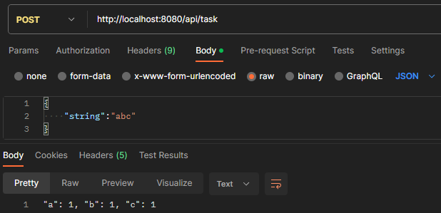

# Tasks
### Сборка репозитория и локальный запуск
Для запуска вам понадобиться Java 11 и Maven.
#### Выполните в консоли:
1. git clone https://github.com/Kuznetsov-Dmitrii/Tasks.git
2. mvn spring-boot:run

### Формат входящих параметров:
JSON с параметром string
### Формат исходящих параметров:
String 
### Пример 
- Адрес: http://localhost:8080/api/task
- Метод: POST
- Body:
    {
    "string":"abc"
    }
- String: "a": 1, "b": 1, "c": 1
